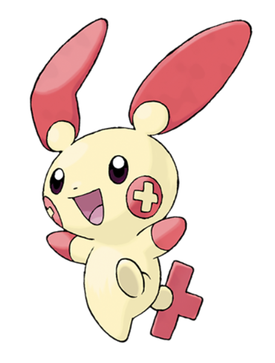
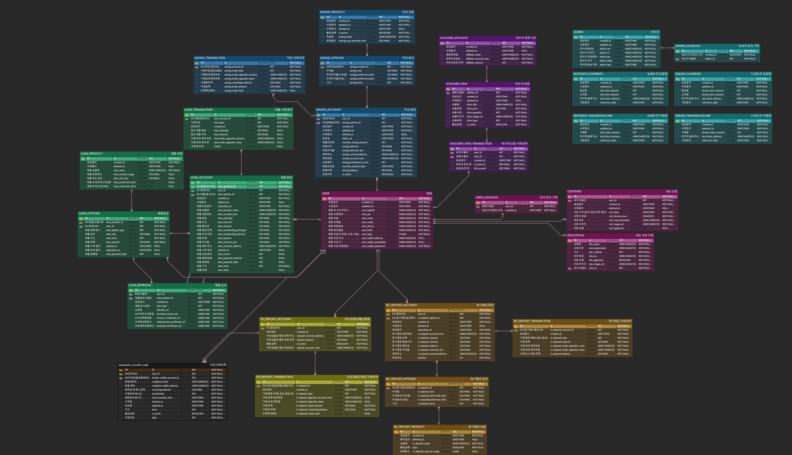
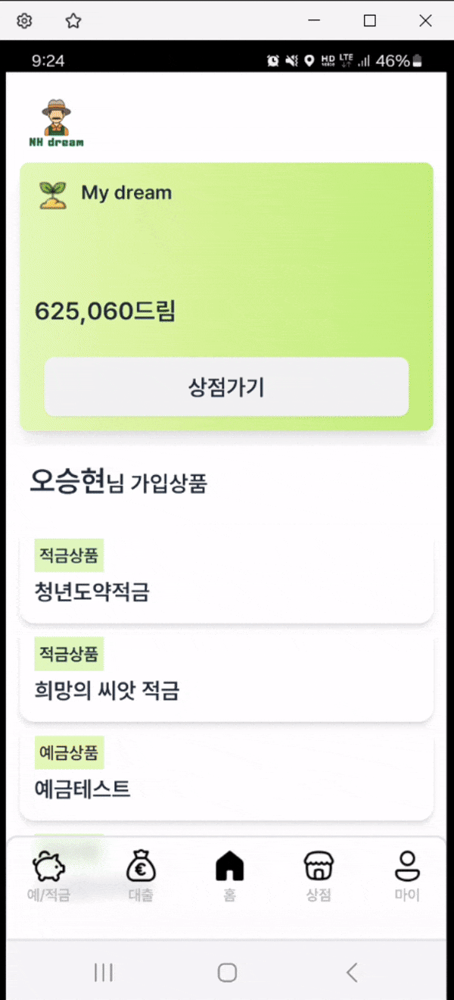
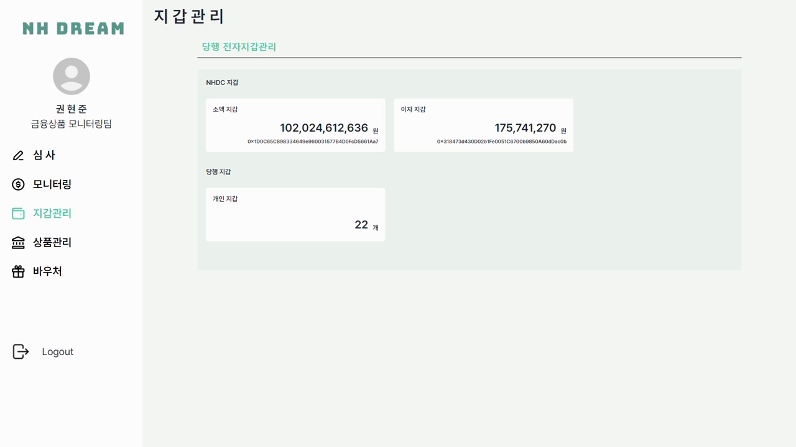

# 💸 NH DREAM : NH농협은행 기업연계 프로젝트💸
## 목차

[1. 개요](#🌽-개요)
 
[2. 팀소개](#🍅-팀소개)
 
[3. 개발환경](#🫛-개발환경)
 
[4. ERD](#🥔-erd)
 
[5. 서비스 아키텍처](#🍠-서비스-아키텍처)
 
[6. 주요기능](#🥒-주요-기능)
 
[7. 서비스화면](#🥦-서비스-화면)

## 🌽 개요

**NH 드림(NH DREAM)** 은 귀농을 준비하는 사람이나 귀농한지 얼마 되지 않은 농부의 경제적인 고민과 문제를 해결하기 위한 CBDC를 기반으로 한 금융 서비스입니다.

### 대상

- NH 청년농부 사관학교 수료생 
- 귀농한지 얼마 되지 않은 농부

### 목표

- 귀농을 준비하는 사람이 예, 적금을 들어 귀농 초반 경제적인 문제를 대비할 수 있다.
- 귀농 초반의 농부가 경제적인 어려움을 대출 서비스로 극복하고 농산물 소득이나, 작물 인증을 통해 받은 토큰을 사용해 귀농바우처에서 농사에 필요한 물품을 구매할 수 있다.
- 농부의 인증, 검사 정보나 수료 정보에 따라 금리가 변경되어 농촌 생활 정착에 기여를 할 수 있다.
- 은행은 검증과정을 거치고 우대 금리를 부여해 더 성실하고 신뢰성 있는 농부를 고객으로 둘 수 있다.
- 한국은행의 CBDC가 진행되었을 때 자사에서 제공되던 기존 금융 서비스를 CBDC에 맞게 서비스 할 수 있다.

 

## 🍅 팀소개

### Frontend

|이정민|장세정|권현준|
| :---------------------------------------------------------: | :--------------------------------------------------------: |:--------------------------------------------------------: |
|  |  |  |
|[@minimimin](https://github.com/minimimin)|[@wkdtpwjd19](https://github.com/wkdtpwjd19)|[@Kwonhyunjun](https://github.com/Kwonhyunjun)|
|금융 상품 관련 전반   통합관리 내역   관리자 토큰 지갑 web3|프로젝트 구조 구성   거래, 작물, 마이팜|프로젝트 구조 구성   거래, 작물, 마이팜|

### Backend

|                       김준엽                        |                        권현준                         |                       오승현                       |                      조현제                      |
| :-------------------------------------------------------: | :---------------------------------------------------------: | :--------------------------------------------------------: | :--------------------------------------------------------: |
|  |  |  |  |
|      [@junyeop1322](https://github.com/junyeop1322)       |       [@Kwonhyunjun](https://github.com/Kwonhyunjun)        |           [@timber3](https://github.com/timber3)           |           [@zziru95](https://github.com/zziru95)           |
|                        팀장   대출 API   AWS S3  SSE  알림 기능             |                           서기   회원 및 관리자 API   정기예금 API    배치 및 스케줄러                            | 발표자                 인프라 구축    바우처 관련 API                      |                    Solidity 작성  (적금, 대출, NHDC)   적금 및 이체 API   배치 및 스케줄러                  |

 

## 🫛 개발환경

### Frontend

zustand 

### Backend

batch / springboot 로 수정 / security

### Infra

### Blockchain

web3j / ganache

### Others

 

## 🥔 ERD

 

## 🍠 서비스 아키텍처

 

## 🥒 주요 기능
### 일반 유저
<table style="word-break: keep-all;">
<tr ><th style="text-align:center;">기능</th><th>내용</th></tr>

<tr>
  <td style="text-align:center;">지갑(이체)</td>
  <td>블록체인 지갑 주소를 바탕으로 NHDC, DRDC 거래 및 결제를 진행합니다.</td>
</tr>

<tr>
  <td style="text-align:center;">CBDC토큰 (NHDC)</td>
  <td>ERC-20 기반 토큰인 NHDC는 개인 간 이체뿐만 아니라 다양한 금융 상품 컨트랙트에서도 사용될 수 있어 마치 현금처럼 이용이 가능합니다.</td>
</tr>

<tr>
  <td style="text-align:center;">바우처(DRDC)</td>
  <td>DRDC는 미래에 도입될 CBDC와 동일한 용도로 사용할 ERC20 규격의 블록체인 기반 토큰으로 상품 가입 시 쌓이는 포인트와 비슷한 개념의 재화입니다. DRDC는 유저 간 거래가 불가능하지만 NHDC와 구별되어 바우처 상품을 구매할 때 사용할 수 있습니다.</td>
</tr>

<tr>
  <td style="text-align:center;">금융상품(예적금, 대출)</td>
  <td>이용자는 이자계산기를 각 상품과 기간에 따른 이자율을 손쉽게 계산할 수 있고 해당 정보를 토대로 예금 및 적금 상품을 가입할 수 있습니다.</td>
</tr>

<tr>
  <td style="text-align:center;">만기처리   자동이체</td>
  <td> 배치 시스템을 통해 데이터베이스에서 오늘의 이체 날짜와 만기 일자를 조회한 후, 로직을 처리하여 결과를 데이터베이스에 업데이트합니다.</td>
</tr>

<tr>
  <td style="text-align:center;">알림 서비스 (SSE)</td>
  <td>서버에서 지갑 입출금시, 예적금 및 대출 가입, 만기 처리 등의 이벤트 발생 시 SSE를 통해 실시간으로 이벤트를 전송하면
 프론트엔드에서는 이러한 이벤트를 수신하여 사용자에게 즉각적인 알림을 제공합니다.</td>
</tr>

</table>

 

### 관리자
<table style="word-break: keep-all;">
<tr ><th style="text-align:center;">기능</th><th>내용</th></tr>
<tr>
  <td style="text-align:center;">로그인 보안</td>
  <td>사용자가 스마트 디바이스를 이용하여 금융 서비스를 이용할 때 가상 키패드를 통해 입력하는 정보를 키로거가 수집함으로써, 공격자는 사용자의 동의 없이도 민감정보 유출이 가능하다. 이를 방지하기 위해 랜덤 키보드를 적용하여 사용자의 입장에서 보안을 강화하였다.</td>
</tr>
<tr>
  <td style="text-align:center;">심사</td>
  <td>관리자는 교육 및 대출 신청 현황 및 귀농 승인 현황을 조회할 수 있고 해당 신청 정보에 따라 승인 및 반려 처리를 할 수 있습니다.</td>
</tr>

<tr>
  <td style="text-align:center;">모니터링</td>
  <td>관리자는 현재 전체적인 NHDC의 발급량(민트량), 소각량, 유동량을 조회할 수 있습니다. 또한 설정한 기간에 해당하는 일자별 발급량과 소각량을 바차트로 거래량을 선차트로 시각화하여 토큰의 흐름을 효과적으로 모니터링할 수 있습니다.</td>
</tr>

<tr>
  <td style="text-align:center;">지갑 현황</td>
  <td>관리자가 지속적으로 고객들의 정보를 수합하고 분석하여 서비스를 원활하게 운영할 수 있도록 web3.js를 통해 one-step으로 블록체인과 연동하여 실시간 데이터 모니터링을 가능하도록 하였다.</td>
</tr>

<!-- <tr>
  <td style="text-align:center;">상품 등록</td>
  <td></td>
</tr>

<tr>
  <td style="text-align:center;">바우처 관리</td>
  <td></td>
</tr> -->
</table>

 

## 🥦 서비스 화면
### 1. 일반 유저
<!-- 1. 회원가입 & 로그인 (권현준) -->

  

    
  
로그인 & 회원가입

  

<!-- 2. 예&적금 (이자계산기) : 가입 -> 마이계좌에서 조회 (권현준, 조현제, 이정민(gif)) -->

  

    
    
예금

  

  

    
    
적금

  

  

    
    
대출

  

  

    
    
대출 심사

  

<!-- 4. 지갑 (+이체, 알림) : 이체 -> 알림 받기 (장세정) -->

  

    
  
이체

  

<!-- 6. 바우처 -->

  

     
  
바우처

  

### 2. 관리자

  

     
  
로그인

  

  

     
  
심사

  

  

     
  
모니터링

  

  

     
  
지갑현황

  

